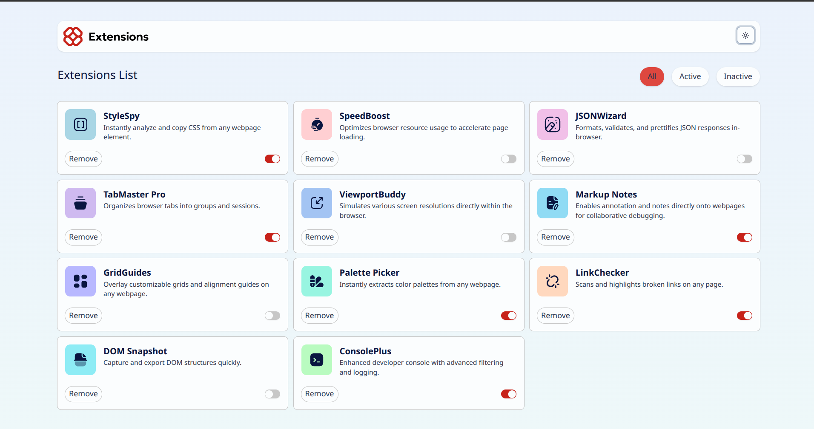
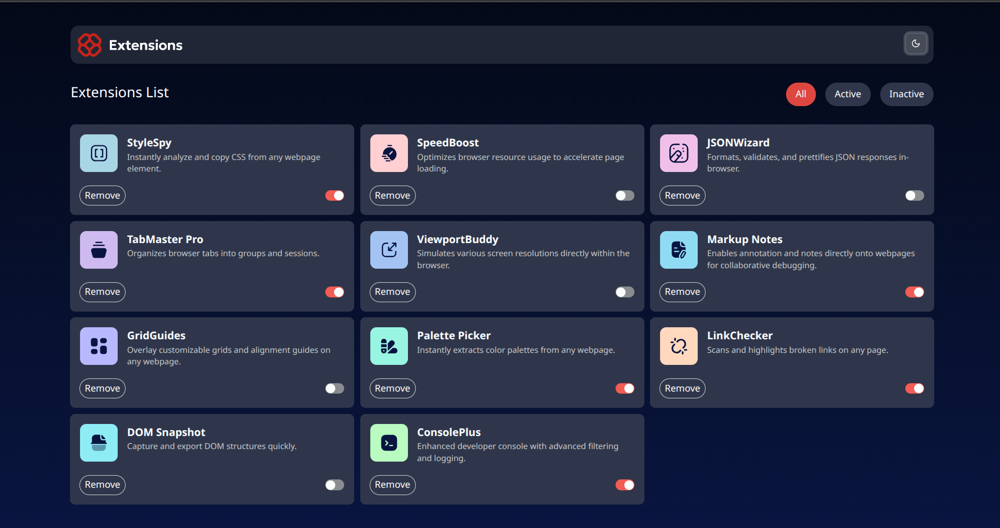

# Frontend Mentor - Browser extensions manager UI solution

This is a solution to the [Browser extensions manager UI challenge on Frontend Mentor](https://www.frontendmentor.io/challenges/browser-extension-manager-ui-yNZnOfsMAp).

## Table of contents

- [Overview](#overview)
  - [Screenshot](#screenshot)
  - [Links](#links)
- [My process](#my-process)
  - [Built with](#built-with)
  - [What I learned](#what-i-learned)
- [Author](#author)

## Overview

### Screenshot

### Links

- Solution URL: [Link](https://your-solution-url.com)
- Live Site URL: [Vercel](https://extention-view-ui-react.vercel.app/)

## My process

### Built with

- [React](https://reactjs.org/) - JS library
- Tailwind

### What I learned

In this challenge, I learned how to manage state in React, use the browser's local storage to persist data, and integrate ShadCN components into my project.

## Author

- Frontend Mentor - [@NedjimaAyoub](https://www.frontendmentor.io/profile/Mohammed-Nedjima)
- Github - [@NedjimaAyoub](https://github.com/Mohammed-Nedjima)
